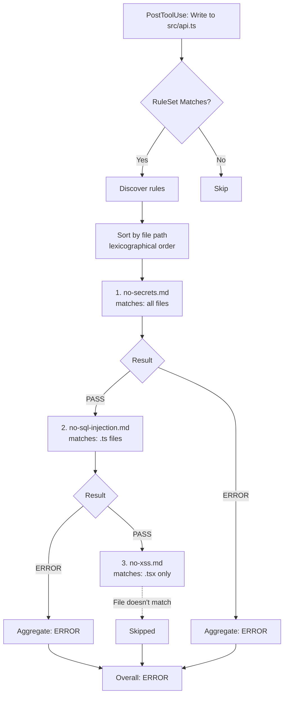

# RuleSets

A **RuleSet** is a logical grouping of related validation rules organized in a folder structure. Instead of maintaining separate validators for each check, RuleSets let you organize related rules together.

## Why RuleSets?

### Organization

Group related rules by domain, concern, or team:

```
.avp/validators/
├── security-rules/        # All security checks
│   └── rules/
│       ├── no-secrets.md
│       ├── no-sql-injection.md
│       └── no-xss.md
├── code-quality/          # Quality standards
│   └── rules/
│       ├── no-console.md
│       └── require-tests.md
└── team-conventions/      # Team-specific rules
    └── rules/
        ├── naming-conventions.md
        └── import-order.md
```

### Shared Resources

Rules within a RuleSet share common resources:

- **Scripts**: Reusable detection logic in `scripts/`
- **References**: Shared documentation in `references/`
- **Assets**: Common patterns or templates in `assets/`
- **Configuration**: Parent match conditions and triggers

### Progressive Disclosure

RuleSets support efficient context usage through layered information:

1. **Metadata** (~100 tokens): Name, description loaded at discovery
2. **VALIDATOR.md** (~500 tokens): RuleSet overview and configuration
3. **README.md** (~1000 tokens): Detailed documentation loaded on demand
4. **Rule files** (~500 tokens each): Individual validation logic loaded when triggered
5. **References** (as needed): Additional documentation loaded when referenced

This means agents only load what they need, when they need it.

### Versioning

RuleSets track versions via the `metadata.version` key, following [Agent Skills conventions](https://agentskills.io/specification#metadata-field). We recommend [Semantic Versioning](https://semver.org/):

```yaml
metadata:
  version: "1.0.0"    # Initial release
  version: "1.1.0"    # Added no-xss.md rule
  version: "1.2.0"    # Added no-sql-injection.md rule
  version: "2.0.0"    # Changed no-secrets severity to error
```

## RuleSet Structure

### Required Files

Every RuleSet must have:

#### VALIDATOR.md

The main configuration file defining RuleSet metadata:

```yaml
---
name: security-rules
description: Comprehensive security validation for code changes
trigger: PostToolUse
match:
  tools: [Write, Edit]
tags:
  - security
metadata:
  version: "1.0.0"
---

# Security Rules

Validates code changes against common security vulnerabilities.

All rules in the `rules/` directory are automatically discovered and loaded.
```

#### rules/ Directory

Contains individual rule files, each with its own validation logic. All `.md` files in this directory and its subdirectories are automatically discovered and loaded as rules.

```
rules/
├── no-secrets.md           # Discovered automatically
├── no-sql-injection.md     # Discovered automatically
├── no-xss.md              # Discovered automatically
├── security/              # Subdirectories for organization
│   ├── no-eval.md
│   └── no-unsafe-regex.md
└── quality/
    ├── no-console.md
    └── complexity-check.md
```

**Discovery rules**:
- All `.md` files are loaded recursively from `rules/` and subdirectories
- Files are sorted by full path in lexicographical order
- Subdirectories can organize rules by category (security/, quality/, etc.)
- Each must have valid YAML frontmatter
- Rule names must be unique within the RuleSet

**Execution order**: Rules run sequentially in lexicographical order by file path:
```
rules/01-first.md           # Runs 1st
rules/02-second.md          # Runs 2nd
rules/security/crypto.md    # Runs 3rd
rules/zzz-last.md          # Runs last
```

Each rule file includes:

```yaml
---
name: no-secrets
description: Detects hardcoded secrets
severity: error
---

# No Secrets Rule

Check for hardcoded credentials...
```

### VALIDATOR.md vs README.md

Understanding the difference:

| File | Audience | Purpose | Content |
|------|----------|---------|---------|
| **VALIDATOR.md** | Agents | Metadata & instructions | Triggers, tags, metadata, prompt for sub-agent |
| **README.md** | Humans | User documentation | Installation, usage guide, configuration examples |

**When they're used**:
- **VALIDATOR.md** is loaded by the agent when the validator activates
- **README.md** is read by developers browsing the validator directory

### Optional Files

#### README.md

User-facing documentation for installation, usage, and configuration:

```markdown
# Security Rules

Comprehensive security validation for code changes based on OWASP Top 10.

## Installation

1. Clone this validator:
   ```bash
   mkdir -p .avp/validators
   cd .avp/validators
   git clone https://github.com/example/security-rules.git
   ```

2. The validator activates automatically on the next `PostToolUse` event.

## What It Checks

- **no-secrets** (error): Blocks hardcoded API keys, passwords, tokens
- **no-sql-injection** (error): Detects unsafe SQL query construction
- **no-xss** (warn): Identifies XSS vulnerabilities in frontend code

## Configuration

### Adjusting Severity

Edit individual rule files to change severity levels:
```yaml
# rules/no-xss.md
severity: error  # Change from 'warn' to 'error'
```

### Disabling Rules

Remove or rename rules you don't need:
```bash
rm rules/no-xss.md
# or
mv rules/no-xss.md rules/no-xss.md.disabled
```

## Version History

See VALIDATOR.md for version information.
```

**README.md is for humans** browsing the directory who want to know:
- How to install and use the validator
- What rules are included
- How to configure or customize it

#### favicon.png

Visual icon for decoration in UIs (16x16, 32x32, or 64x64 pixels):

```yaml
favicon: favicon.png
```

#### scripts/

Shared executable scripts used by multiple rules:

```
scripts/
├── detect-secrets.py
├── check-sql-patterns.sh
└── scan-xss.js
```

#### references/

Additional documentation loaded on demand:

```
references/
├── owasp-guidelines.md
├── secret-patterns.md
└── sql-injection-examples.md
```

#### assets/

Templates, patterns, or data files:

```
assets/
├── secret-patterns.json
├── sql-keywords.txt
└── xss-test-cases.yaml
```

## Rule Inheritance

Rules inherit configuration from the parent VALIDATOR.md but can override specific settings.

### Inherited Settings

Rules automatically inherit:

- `trigger` — When to run
- `match.tools` — Which tools to match
- `match.files` — File patterns to match
- `timeout` — Execution timeout

### Override Example

**VALIDATOR.md**:
```yaml
---
name: security-rules
trigger: PostToolUse
match:
  tools: [Write, Edit]
  files: ["**/*.ts", "**/*.js"]
---
```

**rules/no-secrets.md** (inherits all settings):
```yaml
---
name: no-secrets
description: Detects secrets
severity: error
---
```

**rules/no-xss.md** (overrides file matcher):
```yaml
---
name: no-xss
description: Detects XSS
severity: warn
match:
  files: ["**/*.tsx", "**/*.jsx"]  # Only frontend files
---
```

## Rule-Level Severity

Each rule specifies its own severity, allowing mixed blocking and non-blocking rules:

```yaml
# rules/no-secrets.md - Blocking
severity: error

# rules/no-console.md - Non-blocking
severity: warn

# rules/code-style.md - Informational
severity: info
```

When multiple rules trigger, the most severe outcome determines behavior:

| Rule Results | Overall Outcome |
|--------------|-----------------|
| All pass | **PASSED** — continue |
| Some `warn` | **WARNED** — log warnings, continue |
| Any `error` | **ERROR** — block until fixed |

## Execution Model

**Two-level execution:**

1. **Validators run in parallel** — Multiple RuleSets execute concurrently
2. **Rules run sequentially** — Within each validator, rules execute in lexicographical order

### Within a Single Validator

When a hook event fires, a validator executes as follows:

1. **Match trigger**: Check if the trigger matches (e.g., `PostToolUse`)
2. **Match conditions**: Check parent `match.tools` and `match.files`
3. **Discover rules**: Find all `.md` files in `rules/` recursively
4. **Sort rules**: Order by file path (lexicographical)
5. **Execute sequentially**: Run rules in order, one at a time
6. **Filter per rule**: Each rule can override parent match conditions
7. **Aggregate results**: Combine results, most severe wins



**Note:** Rules execute sequentially. If an earlier rule fails with `error` severity, later rules still run — all violations are collected before reporting.

## Best Practices

### Keep Rules Focused

Each rule should check one specific concern:

**Good**:
- `no-secrets.md` — Detects hardcoded credentials
- `no-sql-injection.md` — SQL injection patterns
- `no-xss.md` — XSS vulnerabilities

**Bad**:
- `security-checks.md` — Checks everything (hard to maintain)

### Use Appropriate Severity

- **error**: Security vulnerabilities, broken code, critical standards
- **warn**: Style issues, deprecated patterns, code smells
- **info**: Suggestions, metrics, informational messages

### Document Well

Include a README.md that explains:
- What the RuleSet validates
- Each rule and its severity
- How to configure or customize
- Examples of violations and fixes

### Version Thoughtfully

Use `metadata.version` with semantic versioning:
- **Patch** (1.0.1): Bug fixes, improved detection
- **Minor** (1.1.0): New rules added, backward compatible
- **Major** (2.0.0): Removed rules, changed behavior, breaking changes

### Organize Resources

Use subdirectories to keep RuleSets maintainable:

```
security-rules/
├── VALIDATOR.md           # <500 lines
├── README.md              # <1000 lines
├── rules/                 # Each <500 lines
│   ├── no-secrets.md
│   ├── no-sql-injection.md
│   └── no-xss.md
├── scripts/               # Executable helpers
│   └── detect-secrets.py
└── references/            # Detailed docs
    └── owasp-top-10.md    # >1000 lines OK here
```

## Discovery

Validators are discovered from:

1. **Project**: `.avp/validators/` in the project root
2. **User**: `~/.avp/validators/` in the user's home directory

Project validators take precedence over user validators with the same name.

### Example Layout

```
.avp/validators/
├── security-rules/
│   ├── VALIDATOR.md
│   ├── README.md
│   ├── favicon.png
│   └── rules/
│       ├── no-secrets.md
│       ├── no-sql-injection.md
│       └── no-xss.md
├── code-quality/
│   ├── VALIDATOR.md
│   └── rules/
│       ├── no-console.md
│       └── require-tests.md
└── team-conventions/
    ├── VALIDATOR.md
    └── rules/
        ├── naming-conventions.md
        └── import-order.md
```

Each RuleSet is independent and can be enabled/disabled by adding or removing its directory.
