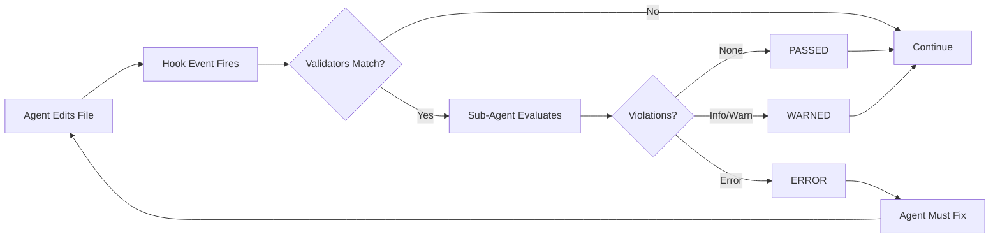

# Validator Lifecycle

Validators work by spawning a sub-agent to review changes made by the primary agent. This automated review catches issues the agent might miss.

## Execution Flow

Validators follow a predictable lifecycle that integrates with the agent's hook system:



## Detailed Steps

### 1. Agent Edits File

The agent uses a tool like `Write`, `Edit`, or `MultiEdit` to modify a file in your project.

### 2. Hook Event Fires

After the tool completes, the agent fires the appropriate hook event. Most validators use `PostToolUse`, which fires after any tool succeeds.

### 3. Matching Validators Run

Each validator checks if it should run based on:

- **Tool matcher**: Does the tool match (e.g., Write, Edit)?
- **File patterns**: Does the file match (e.g., *.ts, *.jsx)?
- **Trigger type**: Is this the right hook event?

### 4. Sub-Agent Evaluates

For each matching validator, a sub-agent is spawned with the VALIDATOR.md prompt. The sub-agent receives the diff of changes and evaluates them against the rules.

### 5. Results Aggregated

All validator results are collected and the most severe outcome determines the overall result:

- **PASSED**: All validators passed - continue normally
- **WARNED**: Some warnings found - log and continue
- **ERROR**: Errors found - must fix before proceeding

## Response Format

Validators return a standardized JSON response:

```json
{
  "passed": true | false,
  "violations": [
    {
      "rule": "rule-name",
      "file": "path/to/file.ts",
      "line": 42,
      "snippet": "problematic code",
      "suggestion": "how to fix it"
    }
  ],
  "summary": "Human-readable summary"
}
```

## Best Practices

- Keep validators focused - one concern per validator
- Use appropriate severity - don't block on style issues
- Provide actionable suggestions in violation messages
- Include line numbers and code snippets for context
- Keep estimated token usage low for faster execution
