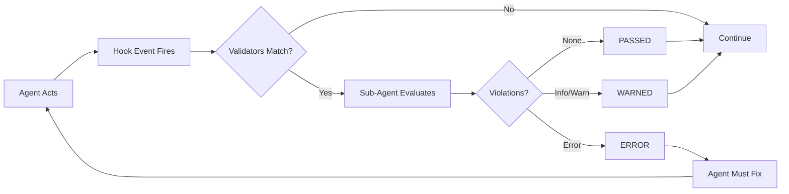
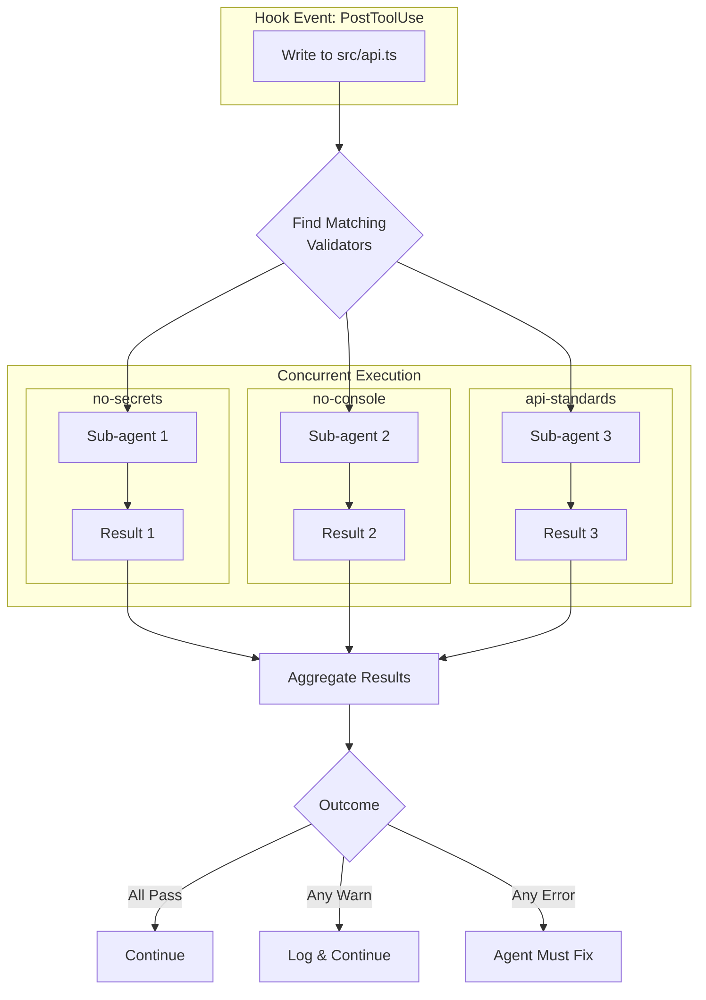

# Validator Lifecycle

Validators work by spawning a sub-agent to review changes made by the primary agent. This automated review catches issues the agent might miss.

## Execution Flow

Validators follow a predictable lifecycle that integrates with the agent's hook system:

## Detailed Steps

### 1. Agent Acts

Each turn of the AI agent is a chance to validate.

### 2. Hook Event Fires

After the tool completes, the agent fires the appropriate hook event. Most validators use `PostToolUse`, which fires after any tool succeeds.

### 3. Matching Validators Run

All validators in the validator directories (`.avp/validators/` and `~/.avp/validators/`) are checked against the event. Each validator matches based on:

- **Trigger type**: Does the hook event match (e.g., `PostToolUse`, `Stop`)?
- **Tool matcher**: Does the tool match (e.g., Write, Edit)?
- **File patterns**: Does the file match (e.g., *.ts, *.jsx)?
- **Trigger matcher**: For lifecycle events, does the source match (e.g., `startup`)?

Multiple validators can match the same event. For example, a `Write` to `src/api.ts` might match:
- `no-secrets` (matches all Write/Edit)
- `no-console` (matches *.ts files)
- `api-standards` (matches src/api/** files)

### 4. Parallel Evaluation

All matching validators run concurrently, each spawning its own sub-agent:

Each sub-agent receives the VALIDATOR.md prompt content along with context about the event. Implementations should provide relevant context in natural language, including:

- **Tool name**: Which tool was called (e.g., Write, Edit, Bash)
- **File path**: The full path of the file being modified (if applicable)
- **File content or diff**: The changes made or relevant file content
- **Tool parameters**: Any additional parameters passed to the tool

The sub-agent processes this context and returns its assessment in natural language, including:

- A decision: `allow` (passed) or `deny`/`block` (failed)
- Details about any violations found
- Suggestions for how to fix issues

When validation fails, the validator's **severity** determines the consequence (see [Severity Levels](/validators/severity)).

### 5. Results Aggregated

Results from all validators are collected. The aggregation rules:

| Individual Results | Aggregated Outcome | Behavior |
|-------------------|-------------------|----------|
| All validators pass | **PASSED** | Continue normally |
| Any validator fails with `warn` severity | **WARNED** | Log warnings, continue |
| Any validator fails with `error` severity | **ERROR** | Block until fixed |

When multiple validators fail:
- All violations are combined into a single report
- The agent sees all issues at once, not one at a time
- This enables efficient batch fixing

## Error Handling

When a validator fails to execute (timeout, crash, malformed YAML, missing files), implementations should **fail closed** — treat the error as a blocking violation.

This fail-closed behavior ensures that:
- Broken validators don't silently allow bad code through
- Developers are immediately aware of validator issues
- Security-critical checks aren't bypassed due to configuration errors

Common error conditions:
- **Timeout**: Sub-agent exceeds the configured timeout
- **Malformed YAML**: Invalid frontmatter in VALIDATOR.md
- **Missing references**: Referenced files don't exist
- **Sub-agent failure**: The validation sub-agent crashes or returns invalid output

## Best Practices

- Keep validators focused - one concern per validator
- Use appropriate severity - don't block on style issues
- Provide actionable suggestions in violation messages
- Include line numbers and code snippets for context
- Keep estimated token usage low for faster execution
